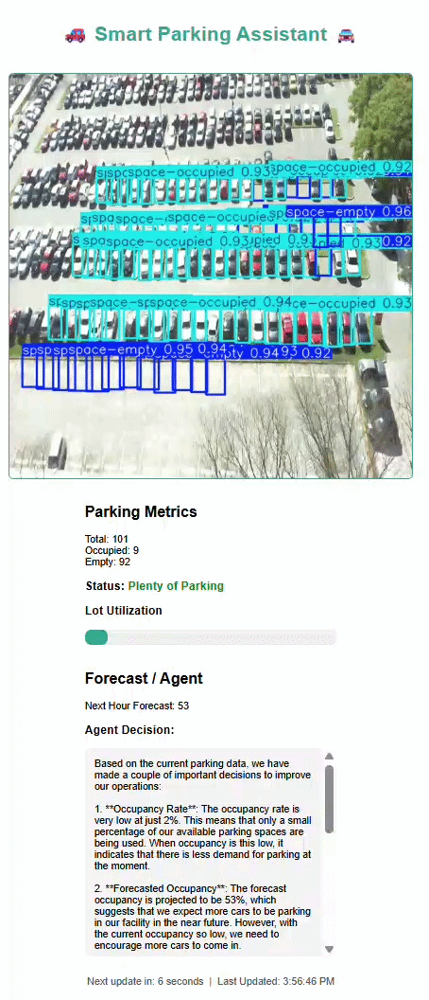

# 🚗 Smart Parking AI System

An end-to-end AI-powered system that transforms parking lot images into real-time operational decisions using computer vision, forecasting, and agent-based reasoning.

---

### 📌 Overview

Smart Parking Monitor is an AI-powered parking analytics system that performs real-time parking lot monitoring using computer vision and a lightweight agent decision layer.

The application analyzes parking lot images using a YOLO-based object detection pipeline to determine occupancy metrics such as:

- Total parking spaces
- Occupied spaces
- Available spaces

These metrics are combined with a simple forecasting model and an agent reasoning layer that generates operational recommendations for parking management.

The system exposes these results through a FastAPI backend, a real-time web dashboard, and a REST API that can be integrated into other systems.

The entire application is containerized using *Docker*, enabling easy deployment on any machine with Docker installed.

---

### 📋 Key Features

#### 👁️ Computer Vision Parking Detection

Uses a YOLO inference pipeline to detect vehicles and compute parking occupancy statistics.

#### ⚙️ Real-Time Dashboard

A browser-based dashboard displays:
- Live parking lot video frames
- Occupancy statistics
- Parking utilization visualization
- Forecast predictions
- AI-generated operational recommendations

#### 🧠 Agent Decision Layer

An AI-driven decision module analyzes parking metrics and forecasts to generate insights such as:
- Pricing recommendations
- Traffic management guidance
- Parking capacity alerts

#### ⚡REST API

The system exposes API endpoints for retrieving real-time parking metrics and video frames.

#### 🫙 Containerized Deployment

The entire application runs in a Docker container, ensuring consistent execution across development and production environments.

---

### 🏢 Example Use Cases

1. 🛜 Smart Cities
    - monitor municipal parking availability.

2. 🏪 Retail Analytics
    - Optimize parking utilization for shopping centers.

3. 📱 Urban Mobility Research
    - Analyze parking demand trends and traffic flow.

---

### 🎯 Business Value (ROI)

This system is designed to deliver measurable impact:

- 💰 **Revenue Optimization**: Dynamic pricing based on occupancy  
- 💸 **Cost Reduction**: Reduced need for manual monitoring  
- ⚙️ **Operational Efficiency**: Automated alerts and decisions  
- 🚗 **Customer Experience**: Reduced search time for parking  

---

### 🏗️ System Architecture

<p align="center">
    
</p>

---

### Technology Stack

| Component         | Technology        |
|:-----------------:|:-----------------:|
| Backend API       | FastAPI           |
| Computer Vision   | YOLO              |
| Image Processing  | OpenCV            |
| Agent Reasoning   | OpenAI            |
| Frontend          | HTML + JavaScript |
| Containerization  | Docker            |
| Language          | Python            |

---

### 📋 Prerequisites
- **WSL: Ubuntu**
- **Python 3.10**
- **OpenAI API key** # put in .env file

---

### 📸 **Video Demo**
<p align="center">
    
</p>

---

### 📊 Model Training Summary
    * Model: YOLOv8 (Ultralytics)
    * Dataset: PKLot
    * Task: Vehicle detection
    * Metrics:
        - maP@0.5: 0.99
        - mAP@50_95: 0.97
        - Precision: 0.998
        - Recall: 0.998

---

### Installation - for running locally

### 1. Clone the repository

```bash
git clone -b feature/version-3 https://github.com/scouring/agentic-parking-monitor-I.git
cd agentic-parking-monitor-I
```

### 2. Create a Virtual Environment
```bash
## Using python venv
python3 -m venv .venv
source .venv/bin/activate # Windows: .venv\Scripts\activate

## Using conda
conda activate venv # whatever the name of the env
```

### 3. Install dependancies
```bash
pip install -r requirements.txt
```

### 4. Run locally
```bash

uvicorn api.main:app --reload
```

### 5. Open a webpage for the UI
```bash
http://localhost:8000
```

---

### Running with Docker

### 1. Build the image
```bash
docker build -t smart-parking-monitor .
```

### 2. Run the container (input your OpenAI API key)
```bash
docker run -p 8000:8000 \
 -e OPENAI_API_KEY = your_key_here \
  smart-parking-monitor
```

### 3. Open:
```bash
http://localhost:8000
```

---

### Project Structure
```text
agentic-parking-monitor/
│
├── api/
│   └── main.py
│
├── services/
│   ├── frame_service.py
│   ├── yolo_service.py
│   ├── logging_service.py
│   └── forecast_service.py
│
├── agent_service/
│   ├── agent_runner.py
|   ├── decision_engine.py
│   └── tools.py
│
├── frontend/
│   └── index.html
│
├── requirements.txt
├── Dockerfile
└── README.md
```

---

### License

This project is licensed under the [MIT License](LICENSE)

---

### Future Work
- Real-time camera integration
- Multi-lot optimization
- Advanced forecasting (ARIMA, LSTM)
- Notification system (Slack/SMS)
- edge-device inference

